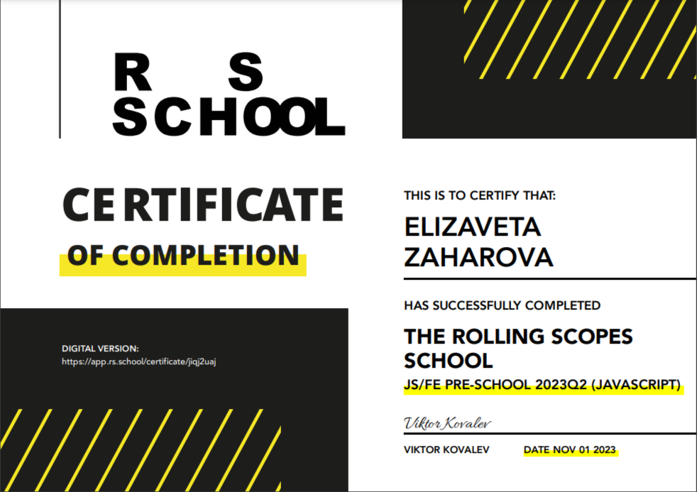
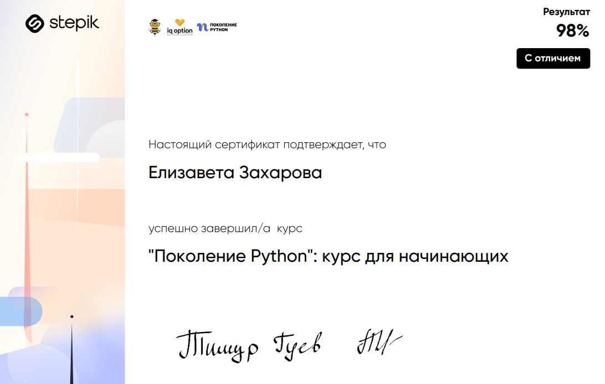

 
# **Elizaveta Zaharova**

# **Contact Information:**

* Location: Saint-Petersburg, Russia
* E-mail: LizaZaharova99@mail.ru
* GitHub: [Tabrisel](https://github.com/Tabrisel)
* Telegram: [Elizaveta Zaharova](https://t.me/Tabrisel)
* Nickname on the RS School discord server: @tabrisel


# **About me:**

Hello, dear reader. My name is Elizaveta and I am a 23-year-old woman, who graduated from St. Petersburg State University of Economics.

My love for the computer **is much more** than just using it for financial planning. I will try to explain why ...

As a child, my hobby was learning new things - I liked to create 3D models and animations. I often enjoyed learning new software (like Adobe Photoshop, Blender, game design, etc). Maybe that's why I grew up and realized that I really liked programming! I enjoy writing code. I like the feeling that I can understand how something works and that I can create something new.
**Literally whatever my heart desires!**❤️

I started my programming journey with Python. Even creating a calculator on it made me delighted! The desire to create something and immediately see the result inspired me so much that I decided to try JS/Frontend development at RS School. **I have successfully completed stage 0. Now i am going through stage 1.** 
Also i am trying to learn JS at a more advanced level. My favorite project helps me a lot with this - I’m making a really good pixel game with using only JS and HTML (yes, I could use ready-constructor for games, but it’s not that interesting, right?)


# **Skills:**

* HTML and CSS, practical layout skills
* JavaScript (data types, operators, loops, conditionals, functions)
* Knowledge of data structures and their organization
* Python
* Git, Github
* VS Code
* Figma
* Adobe Photoshop


# **Example of code:**

```
yesAnswer.addEventListener("change", () => {
    audio.muted = false;
    soundButton.classList.remove("button_OFF");
});

noAnswer.addEventListener("change", e => {
    if (e.target.checked) {
    audio.muted = true;
    soundButton.classList.add("button_OFF");
    }
});
```


# **Experience:**

***My own projects:***

[Game about wizard Kitty 🐾](soon)

***Learning projects from RS School:***

[Library](soon)

[Audio-player](soon)

[Random-game](soon)

[Image-gallery](soon)

[CSS Meme-slider](https://tabrisel.github.io/cssMemeSlider/cssMemeSlider/index.html)


# **Education:**
***University***: Saint Petersburg State University of Economics

***Courses:***

**RS School:** [RS Schools Course «JavaScript/Front-end. Stage 0»](https://rs.school/js-stage0/) - done

RS Schools Course «JavaScript/Front-end» - in progress

**Stepik:** ["Python Generation": a course for beginners](https://stepik.org/58852) - done



# **Languages:**

Russian: my native language

English: A2 (Pre-Intermediate)
